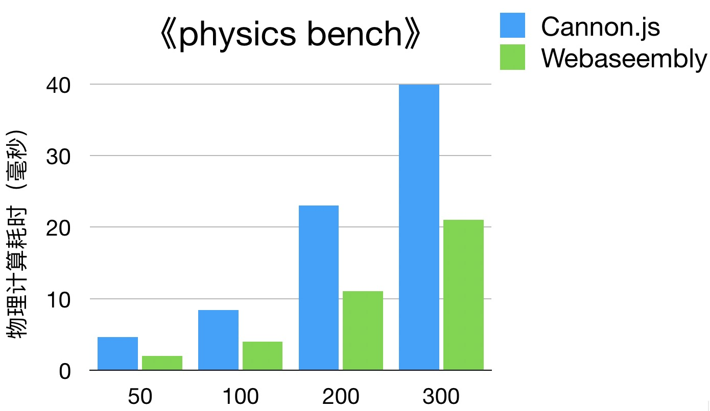

# CannonCPP

|Win32|MacOS|Android|iOS|Webassembly|
| ----|------|-----|-----|-----|
 |  |  |  | 

[CannonCPP](https://github.com/ihago-net/CannonCPP) is a lightweight 3D physics engine written by C++ language. It's ported from [CannonJS](https://github.com/schteppe/cannon.js), originally used in [Hago Game Runtime](https://open.ihago.net) and now released under the [MIT license](https://opensource.org/licenses/MIT). 

## Features

CannonCPP inherits most features from CannonJS:

- Rigid body dynamics
- Discrete collision detection
- Contacts, friction and restitution
- Constraints
	- PointToPoint (a.k.a. ball/socket joint)
	- Distance
	- Hinge (with optional motor)
	- Lock
	- ConeTwist
- Gauss-Seidel constraint solver and an island split algorithm
- Collision filters
- Body sleeping
- Experimental SPH / fluid support
- Various shapes and collision algorithms

To implement CannonCPP, we have

- added a reference counting mechanism to resolve object lifecycle dependence
- added a memory pool to make memory allocation & deallocation faster
- used the dispatcher of world to emit events rather than emitting events by each body in CannonJS
- removed PreStep and PostStep Event for each body

## Documentation

- The API documentation is [here](https://catdoc.github.io/test_pages/)

## Clone this repository

```
$ git clone https://github.com/ihago-net/CannonCPP.git
```

## Run unittest
  ```
  cd ./unittest
  make 
  ```


## Run Demos

### Requirements for Demos

- [Three Cpp: A port of three.js](https://github.com/bergstr11/three.cpp)
- [glfw3](https://www.glfw.org/)
- [stb](https://github.com/nothings/stb)
- [tinyxml2](https://github.com/leethomason/tinyxml2)

These 3rd-party libraries are already included in this project, no additional downloads are required.

- Open your terminal and execute:
```sh
cmake --version
```
If the CMake version is lower than 3.6, please upgrade.

### Win32 
#### Generate Visual Studio projects

```sh
cd cannon-cpp
mkdir win32-build && cd win32-build
cmake .. -G"Visual Studio 15 2017" -Tv141
```

Execute `cmake --build .` to compile,
```
cmake --build . --config Debug
cmake --build . --config Release
```
or open Cannon.sln in Explorer to use the generated project. 

### MacOS
#### Generate macOS Project

```sh
cd cannon-cpp
mkdir mac-build && cd mac-build
cmake .. -GXcode
open Cannon.xcodeproj
```

#### Run on macOS platform

- Open mac-build/Cannon.xcodeproj in Xcode
- Select cannon-demos target
- Build && Run

### iOS
#### Generate iOS Project

```sh
cd cannon-cpp
mkdir ios-build && cd ios-build
cmake .. -GXcode -DCMAKE_TOOLCHAIN_FILE=../cmake/ios.toolchain.cmake
open Cannon.xcodeproj
```

- Open ios-build/Cannon.xcodeproj in Xcode
- Select cannon-demos target
- Build && Run

### Android
- We use the Gradle for Android applications, and Gradle use cmake to build the native code.
- Open demos/proj.android with Android Stuido.
- Build && Run

Tap `Enter` key to switch demos


## Example

```c++
// Create a world
auto world = cannon::World::create();

auto broadphase = cannon::NaiveBroadphase::create()
world->set_broadphase(broadphase);
// broadphase is retained by world, so it could be safely released here.
broadphase->release();

world->set_allowSleep(true);
world->get_defaultMaterial()->set_friction(0.5);
world->get_defaultMaterial()->set_restitution(0);

// Create a ground material
cannon::Material::MaterialOptions matOptions(world->genMaterialId());
auto groundMaterial = cannon::Material::create(matOptions);
groundMaterial->set_friction(0.3);

// Create a ground plane
auto groundShape = cannon::Plane::create(world->genShapeId());

// Create a ground body
cannon::Body::BodyOptions groundBodyOptions(world, world->genBodyId());
groundBodyOptions.mass = 0;
groundBodyOptions.material = groundMaterial;
auto groundBody = cannon::Body::create(groundBodyOptions);

// groundMaterial is retained by groundBody, so it could be safely released here.
groundMaterial->release();

groundBody->addShape(groundShape);

// groundShape is retained by groundBody, so it could be safely released here.
groundShape->release();

world->addBody(groundBody);

// groundBody is retained by world, so it could be safely released here.
groundBody->release();

// Create a box shape
float size = 1;
cannon::Vec3 halfExtents(size, size, size);
auto boxShape = cannon::Box::create(world->genShapeId(), world, halfExtents);

// Create a box body
cannon::Body::BodyOptions boxBodyOptions(world, world->genBodyId());
boxBodyOptions.mass = 1;
auto boxBody = cannon::Body::create(boxBodyOptions);
boxBody->addShape(boxShape);

// boxShape is retained by boxBody, so it could be safely released here.
boxShape->release();

boxBody->get_position().set(0,0,5);
world->addBody(boxBody);

// boxBody is retained by world, so it could be safely released here.
boxBody->release();

//
...
// release world some where
world->release();
//

```

## Build for WebAssembly

### Install Emscripten:

```
$ git clone https://github.com/emscripten-core/emsdk.git
$ cd emsdk
$ git pull
$ ./emsdk install latest
$ ./emsdk activate latest
$ source ./emsdk_env.sh
$ emcc -v
```

- Set `your_emsdk_path/upstream/emscripten` to $EMSCRIPTEN in PATH env

### Compile Wasm:

```
$ cd webassembly
$ $EMSCRIPTEN/emmake make
```

- The `Cannon_v1.0.0_min.wasm.wasm` will be generated in `webassembly/build` directory

### WebAssembly usage for Cocos Creator 3D In [Hago Game Runtime](https://open.ihago.net):

- Copy `Cannon_v1.0.0_min.wasm.js` & `Cannon_v1.0.0_min.wasm.wasm` to the directory where `index.html` exists.
- Add ```<script src="Cannon_v1.0.0_min.wasm.js" />``` to index.html
- Add ```<script src="fix-wrapper.js" />``` to index.html
- Replace main.js with webassembly/main-fix-hago.js
- Hack two functions in physics/framework/util.ts:

  ```ts
    export function setWrap<Wrapper>(object: any, wrapper: Wrapper) {
        // Modify here
        if (CANNON.cc_wrapper_map) {
            CANNON.cc_wrapper_map[object.id] = wrapper;
        }
        else {
            (object as IWrapped<Wrapper>).__cc_wrapper__ = wrapper;
        }
    }

    export function getWrap<Wrapper>(object: any) {
        // Modify here
        if (CANNON.cc_wrapper_map) {
            return CANNON.cc_wrapper_map[object.id];
        }
        else {
            return object.__cc_wrapper__;
        }
    }
  ```

- Hack two functions in physics/framework/cannon/cannon-shared-body.ts:

  ```ts
    addShape(v: CannonShape) {
        let index = this.shapes.indexOf(v);
        if (index < 0) {
            // Modify here
            if (this.body.shapesLength) {
                index = this.body.shapesLength();
            }else{
                index = this.body.shapes.length;
            }
            this.body.addShape(v.impl);
            this.shapes.push(v);
            v.setIndex(index);

            // Modify here
            let offset;
            let orient;
            if (this.body.getShapeOffset && this.body.getShapeOffset) {
                offset = this.body.getShapeOffset(index),
                orient = this.body.getShapeOrientation(index);
            }else{
                offset = this.body.shapeOffsets[index];
                orient = this.body.shapeOrientations[index];
            }
            v.setOffsetAndOrient(offset, orient);
        }
    }

    private onCollided(event: CANNON.ICollisionEvent) {
        CollisionEventObject.type = event.event;
        const self = getWrap<CannonShape>(event.selfShape);
        const other = getWrap<CannonShape>(event.otherShape);

        if (self) {
            CollisionEventObject.selfCollider = self.collider;
            CollisionEventObject.otherCollider = other ? other.collider : null;
            let i = 0;
            for (i = CollisionEventObject.contacts.length; i--;) {
                contactsPool.push(CollisionEventObject.contacts.pop());
            }
            
            // Modify here
            let contactCount;
            if (event.contactCount) {
                contactCount = event.contactCount();
            } else {
                contactCount = event.contacts.length;
            }

            for (i = 0; i < contactCount; i++) {
                let cq;
                // Modify here
                if (event.getContact) {
                    cq = event.getContact(i);
                } else {
                    cq = event.contacts[i];
                }
                // 
                ...
            }
            //
            ...
        }
    }
  ```

- Modify cocos3d-js.js with the following code snippet:

  ```js
    // Position before this line of existing code
    var K8=e("PhysicMaterial",eo("cc.PhysicMaterial")

    // Insert one line of code, after modified
    Y8 = window.WASM_CANNON || Y8;  
    var K8=e("PhysicMaterial",eo("cc.PhysicMaterial")
  ```

### Cannon Webassembly H5 demos  
- [cloth](https://catdoc.github.io/test_pages/webassembly/cannon.js/examples/threejs_cloth.html)
- [fps](https://catdoc.github.io/test_pages/webassembly/cannon.js/examples/threejs_fps.html)
- [mousepick](https://catdoc.github.io/test_pages/webassembly/cannon.js/examples/threejs_mousepick.html)
- [voxel_fps](https://catdoc.github.io/test_pages/webassembly/cannon.js/examples/threejs_voxel_fps.html)
- [worker](https://catdoc.github.io/test_pages/webassembly/cannon.js/examples/worker.html)
- [bodyTypes](https://catdoc.github.io/test_pages/webassembly/cannon.js/demos/bodyTypes.html)
- [bounce](https://catdoc.github.io/test_pages/webassembly/cannon.js/demos/bounce.html)
- [bunny](https://catdoc.github.io/test_pages/webassembly/cannon.js/demos/bunny.html)
- [callbacks](https://catdoc.github.io/test_pages/webassembly/cannon.js/demos/callbacks.html)
- [collisions](https://catdoc.github.io/test_pages/webassembly/cannon.js/demos/collisions.html)
- [collisionFilter](https://catdoc.github.io/test_pages/webassembly/cannon.js/demos/collisionFilter.html)
- [compound](https://catdoc.github.io/test_pages/webassembly/cannon.js/demos/compound.html)
- [constraints](https://catdoc.github.io/test_pages/webassembly/cannon.js/demos/constraints.html)
- [container](https://catdoc.github.io/test_pages/webassembly/cannon.js/demos/container.html)
- [convex](https://catdoc.github.io/test_pages/webassembly/cannon.js/demos/convex.html)
- [events](https://catdoc.github.io/test_pages/webassembly/cannon.js/demos/events.html)
- [fixedRotation](https://catdoc.github.io/test_pages/webassembly/cannon.js/demos/fixedRotation.html)
- [friction](https://catdoc.github.io/test_pages/webassembly/cannon.js/demos/friction.html)
- [heightfield](https://catdoc.github.io/test_pages/webassembly/cannon.js/demos/heightfield.html)
- [hinge](https://catdoc.github.io/test_pages/webassembly/cannon.js/demos/hinge.html)
- [impulses](https://catdoc.github.io/test_pages/webassembly/cannon.js/demos/impulses.html)
- [pile](https://catdoc.github.io/test_pages/webassembly/cannon.js/demos/pile.html)
- [raycastVehicle](https://catdoc.github.io/test_pages/webassembly/cannon.js/demos/raycastVehicle.html)
- [rigidVehicle](https://catdoc.github.io/test_pages/webassembly/cannon.js/demos/rigidVehicle.html)
- [shapes](https://catdoc.github.io/test_pages/webassembly/cannon.js/demos/shapes.html)
- [singleBodyOnPlane](https://catdoc.github.io/test_pages/webassembly/cannon.js/demos/singleBodyOnPlane.html)
- [sleep](https://catdoc.github.io/test_pages/webassembly/cannon.js/demos/sleep.html)
- [sph](https://catdoc.github.io/test_pages/webassembly/cannon.js/demos/sph.html)
- [splitSolver](https://catdoc.github.io/test_pages/webassembly/cannon.js/demos/splitSolver.html)
- [spring](https://catdoc.github.io/test_pages/webassembly/cannon.js/demos/spring.html)
- [stacks](https://catdoc.github.io/test_pages/webassembly/cannon.js/demos/stacks.html)

### Webassembly performance  
- 《physics bench》 is a cannon.js performance test case quoted from Cocos Creator 3D. 
- [physics bench cannon.js](https://catdoc.github.io/test_pages/webassembly/cannon.js/phycisc_bench/)
- [physics bench webassembly](https://catdoc.github.io/test_pages/webassembly/cannon.js/phycisc_bench_wasm/)
- Here we compare the performance difference between cannon.js and webassembly through different numbers of rigid bodies.
  


## TODO:

- Support to create a heightfield with an image
- Fix the rendering problem of demos on ios and android platforms
- Use Dear ImGUI library for adjusting parameters in demos
- CI building
